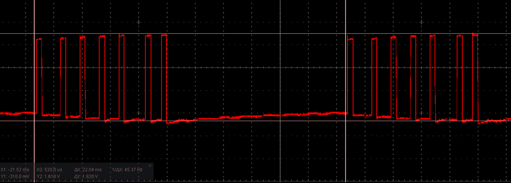
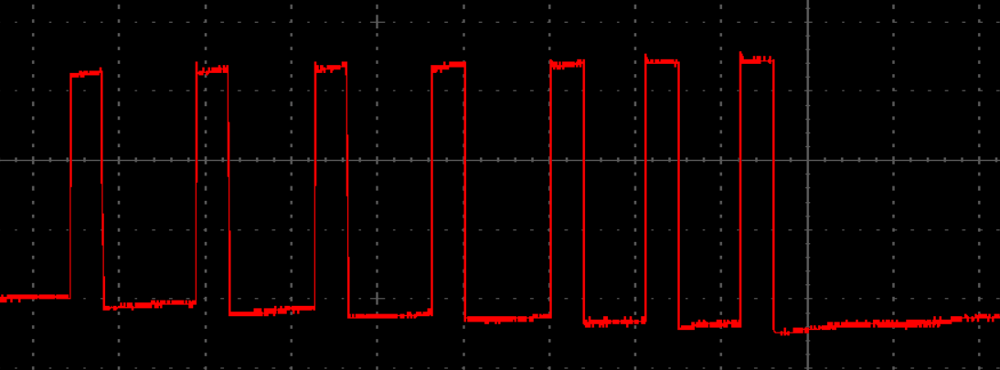
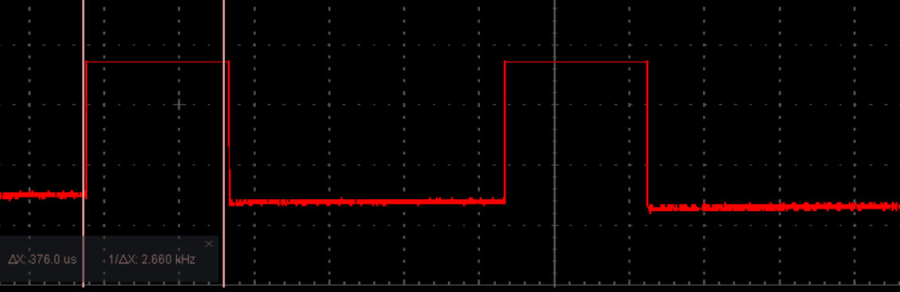
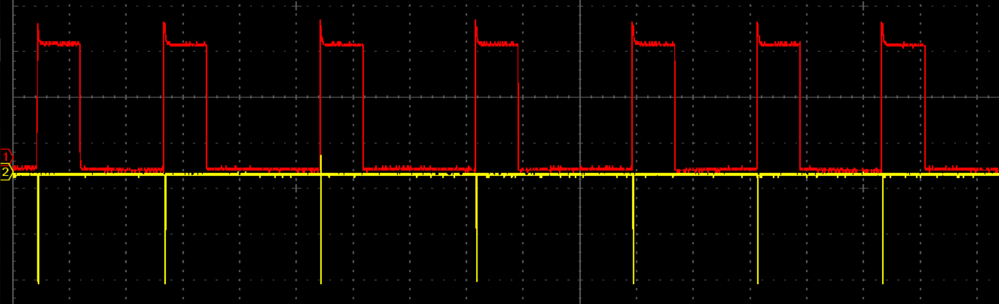
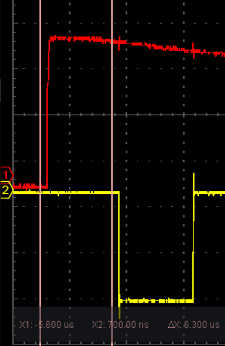
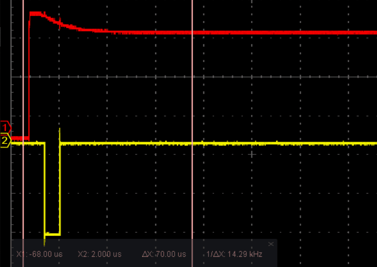

# ppm2usb
**PPM signal to USB Virtual Joystick**

This is a test project with the scope of reading PPM signal from a Spektrum DX5e 5 channel controller (https://www.spektrumrc.com/Products/Default.aspx?ProdId=SPM5500).

The uController used for this is Digispark development board (http://digistump.com/products/1).

Please consider this project “For Educational Purposes Only” since a proper implementation using this uC is not possible because of HW limitations.
Since Attiny85 based microcontroller used in this development boards, lacks USB support this is done using the software implementation "DigiJoystick" (also based on V-USB)

**The problem:** emulated joystick is not stable as you can see from the following recording:
[Emulated Joystick](docs/emulated_joystick.mp4)

**PPM introduction**

Before explaining why this happens let's understand how PPM works:

 
We have here 2 frames of PPM signal. Each frame has around 22mS as you can see from the X axis time markers.
Between 2 frames we have a pause of around 10mS to 15mS.
This is a 6 channel PPM signal from Spektrum DX5e.

Zooming to one frame while playing with gimbals:

We can see that each channel is composed of 2 square signals. The signal can be mirrored on Y axis. It doesn't matter.

Zooming more to first channel from a frame while playing with throttle:

A channel signal has 2 parts:
- one constant part that has ~370uS
- a changing part that has between 800 to 1400uS

In total a channel has ~2000uS (~2mS)

**The reason of the problem**

In following recording I've added some 'debug' information on 2nd channel of oscilloscope:

The 1st channel (red one) is the PPM signal. The 2nd channel (yellow one) is the moment when the interrupt hook is executed when signal raise.

I've just did a *digitalWrite(SOME_PIN, HIGH);digitalWrite(SOME_PIN, LOW);* inside interrupt to catch that moment.

Zooming more we can see that after the signal raise it takes ~6uS for our interrupt to execute the code:

 

Zooming out a bit we can see the problem:

When we use *DigiJoystick* library inside our code our interrupt will not be executed in ~6uS on each signal raise.

Some of our interrupts will be called even after 100uS (use that X axis right marker set at 70uS as a reference).

This will cause inconsistent readings of the moment when the signal rise.

Removing *DigiJoystick* library will fix this but we lose support for USB joystick emulation.

**Connection: TO ADD LATER** 

**Programming: TO ADD LATER**

**Usage: TO ADD LATER**
